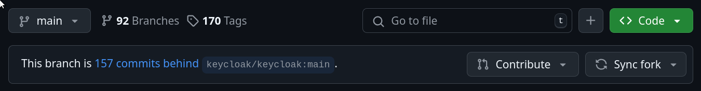

# Sync your keycloak fork with keycloak itself 
Working with the code of keycloak happens in your fork.
Synchronizing the fork and the keycloak repo must at least happen when a pull request is created or updated.
The changes must be a diff to the latest changes:
Avoid pushing something on main of your fork.
Probably have every IDE pointing there closed.

Required:
- git
- ssh
- command-line with shell in a keycloak-root-directory


## GitHub & Command-line
Go to the GitHub page of your fork e.g.: https://github.com/srose/keycloak
and use the *Sync fork* button on the right:


This works regardless of the state the current keycloak-directory is in.

```bash
CURRENT_BRANCH=`git rev-parse --abbrev-ref HEAD`
```

```bash
git stash
```

```bash
git checkout main
```

```bash
git pull
```

```bash
git checkout $CURRENT_BRANCH
```

```bash
git stash pop
```

## Command-line only
Required:
- a remote upstream point to keycloak central in terms of git. Check via `git remote -v`

This works regardless of the state the current keycloak-root directory is in.

```bash
CURRENT_BRANCH=`git rev-parse --abbrev-ref HEAD`
```

```bash
git stash
```

```bash
git checkout main
```

```bash
git fetch upstream
```

```bash
git rebase upstream/main
```

```bash
git push origin main
```

```bash
git checkout $CURRENT_BRANCH
```

```bash
git stash pop
```

## Sync tags of your fork with keycloak tags aka releases.

```bash
git fetch --tags upstream
```

To only push tags to your fork, can be done with push only if 'push.followTags' is set to true in git config.
```bash
git push --tags
```
