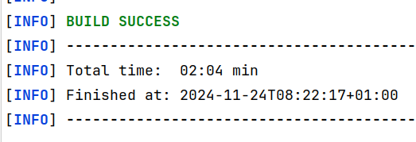

# Build Keycloak from source
Required:
- java in version 21

What about?
- Maven: should be used from the project: mvnw

- pnpm: install locally for the UI parts of Keycloak
- node >= 21: install locally for the UI parts of Keycloak

> [INFO] --- frontend:1.15.0:install-node-and-pnpm (default) @ keycloak-js-parent ---
> [INFO] Installing node version v24.9.0
> [INFO] Unpacking /home/srose/.m2/repository/com/github/eirslett/node/24.9.0/node-24.9.0-linux-x64.tar.gz into /home/srose/repositories/keycloak_srose_II/js/node/tmp
> [INFO] Copying node binary from /home/srose/repositories/keycloak_srose_II/js/node/tmp/node-v24.9.0-linux-x64/bin/node to /home/srose/repositories/keycloak_srose_II/js/node/node
> [INFO] Installed node locally.
> [INFO] Installing pnpm version 10.14.0


## Performance
Activate build-cache for performance
```bash
export MAVEN_OPTS="-Dmaven.build.cache.enabled=true"
```


## Command-line
Full build including tests, which takes a lot of time.
```bash
./mvnw clean install
```

Build without executing tests to save time
```
./mvnw clean install -DskipTests
```

Further flags

| Switch          | Description                                             |
|-----------------|---------------------------------------------------------|
| skipTests       | Prevents test execution                                 |
| skipTestsuite   | Deactivates the Profile *testsuite*, enabled by default |
| skipExamples    | OpenAPI generation without examples                     |
| skipDocs        | Exclude the docs maven module                           |
| maven.test.skip | Skip also test compilation (and execution)            |

Favorite build command?
```bash
./mvnw clean install -Dmaven.test.skip -DskipTests -DskipTestsuite -DskipExamples -DskipDocs
```



## Quarkus distribution
Build a distribution with all adapters using the distribution-profile
```
./mvnw clean install -Pdistribution
```

Find [more profiles and flags](./howto-profiles-and-flags.md) assembled by some GenAI.

### Partial builds

Build only the quarkus part
```
./mvnw -pl quarkus/deployment,quarkus/dist -am -DskipTests clean install
```

Question: What other partial builds are useful to speed up round-trips?

## IDE: IntelliJ
**Hint**: A command-line build is recommended to have everything working in an IDE, see above.
Some maven plugins are generating class files that are necessary.

**Hint**: Use the Build-Menu Item in IntelliJ: *Build Project* but not *Rebuild Project*. 
*Rebuild Project* would remove those class files and you'll end up with compilation errors.

Question: docs/documentation must be added manually in IDE: Could be added to [pom.xml in docs](./docs/pom.xml)?

### Available run-configurations

| Config                | Description                                                 |
|-----------------------|-------------------------------------------------------------|
| mvn-clean-install-min | mvn running clean install goals and skip unnecessary things |

Question: What useful build-configs or templates should be shared?