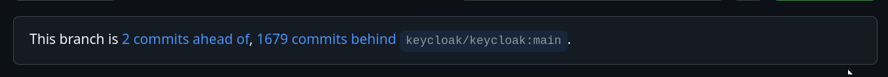

# Contributions 
Keycloak code resides on github.
Any contribution to anything inside https://github.com/keycloak require a pull request (pr). 
A pull request can be initiated/created through the browser/a web based ide or a local machine.

## Local machine: preparation steps
1. Install git 
2. Configure git
3. Optional: install sdkman
4. Install Java >= 21 through os or sdkman
5. Optional: Install Maven through os or sdkman
   - Maven wrapper in root, but useful for subproject runs
6. Generate ssh-key into ~/.ssh/
```bash
TODO install
TODO generate ssh key
```

## Regular task: Local machine: preparation steps
1. Have some "my-ssh-key-available" steps in place

```bash
export CODE_HOME=~/Local/repositories
export KEYCLOAK_LOCAL_DIR=keycloak_my
```

2. Have an environment-variable CODE_HOME in place
```bash
ssh-add ~/.ssh/id_rsa
```

## Github: initialization steps
1. Create a github account: https://github.com/signup
2. Setup your github account with a ssh-key: https://github.com/settings/keys

## Github: prepare git repo to contribute to
- Note: Is there something written on this general contribution pattern?
- Note: Use github cli?
1. Create a fork of the repository you want to contribute to
   - https://github.com/keycloak/keycloak
2. Go to that fork
   - https://github.com/<github-handle>/keycloak
   - https://github.com/srose/keycloak

## Local: prepare git repo
I have multiple local git repos for keycloak, because I did not manage to go have different states/versions at the same time.

```bash
cd $CODE_HOME
```

Clone your fork...
```bash
git clone git@github.com:srose/keycloak.git $KEYCLOAK_LOCAL_DIR
cd $KEYCLOAK_LOCAL_DIR
```

Connect upstream to keycloak repo the fork came from...
```bash
git remote add upstream git@github.com:keycloak/keycloak
```

Optional: Connect other upstreams to other forks
```bash
git remote add upstream_ahus1 git@github.com:ahus1/keycloak
```

Check all remotes:
```bash
git remote -v
```

## Regular task: Local: keep in sync



This works regardless of the state the current directory is in.
Probably have every IDE pointing there closed.

```bash
cd $CODE_HOME/$KEYCLOAK_LOCAL_DIR
```

```bash
CURRENT_BRANCH=`git rev-parse --abbrev-ref HEAD`
```

```bash
git stash
```

```bash
git checkout main
```
```bash
git fetch upstream
```

```bash
git rebase upstream/main
```

```bash
git push origin main
```

```bash
git checkout $CURRENT_BRANCH
```

```bash
git stash pop
```

## Regular task: Local: start a new PR for an issue
Skip today

## Regular task: Local: keep in sync with local work or even a PR in progress
Skip today

## Regular task: Local: finish a PR for an issue
Skip today

## Regular task: Local: build on command line

Favorit build command, ...
```bash
./mvnw clean install -DskipTests
```

... but there is a lot more on [building](../howto-01-build.md#command-line)

## Regular task: Local: open in IDE (IntelliJ)

```bash
/opt/idea/bin/idea.sh $CODE_HOME/$KEYCLOAK_LOCAL_DIR
```

Other IDE-build related info [here](../howto-01-build.md#ide-intellij)

## Regular task: Local: run keycloak on command line - in dev-mode
Skip today

## Regular task: Local: run keycloak in IDE (IntelliJ) in dev-mode

Copy run configs [here](../howto-02-run.md#ide-intellij)

### Just run

First run `launcher-in-memory`...

Open http://localhost:8080 in browser

Run a simple api call from [keycloak-api](../api/keycloak-discovery.http)

### Log
Import [client from ](../config/app1.json)

Enable logging in the run-configuration to e.g. protocol

Stop previous launch

Run `launcher-in-memory-logging`

Run a token call from [keycloak-api](../api/keycloak-client-credentials-grant.http)

### Debug
Enable logging in the run-configuration to e.g. services:

Run `mvn-quarkus-dev-debug`

Run `debug-remote-5005`

Put a breakpoint in TokenEndpoint.java

Run a simple api call from [keycloak-api](../api/keycloak-client-credentials-grant.http)

Step around in the breakpoint, set a response-header?

### Reload changed code?

...

### Continue
See more examples [here](../howto-02-run.md#ide-intellij)

## Local: run keycloak on command line - in prod-mode
Skip today

## Local: run keycloak in IDE (IntelliJ) in prod-mode
Skip today


